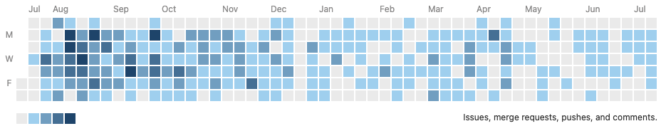

## Work

I'm currently 3 years into life at [Lobaw Digital](https://loblawdigital.co/) learning all things eCommerce. 

In January of 2022, I transitioned from a Frontend specialist to a Full-stack generalist and DevOps manager. My Gitlab graph definitely reflects that change. 

Loblaw Digital does not use Github although I'm a big fan of it especially co-polit.

Depending on the task, I've been writing small Java, Go, and Python programs aka micro-services that monitor our feed servers and SQL database through evented systems. I also spend more time herding cats than code. 

## Work/Play 

Over the last 2 years, I've been collaborating off and on with David & Nick to create a new media sharing app (Expo/React Native) and hobby social network (NestJS & PostgreSQL). 

[Secret project](https://github.com/Project-PD)

Launch: maybe the fall of 2022?!

## Play 

* [Cave Troll: Cracking React, XState & PusherJS Communication](https://dev.to/headwinds/heartbeat-cracking-react-xstate-pusherjs-communication-3bac)
* [Dig Through Python And Create Game Art with Playscii](https://dev.to/headwinds/dig-through-python-and-create-game-art-with-playscii-5dlp)
* [A Guide for Guides: Building a Fun Java App with Tomcat & Maven with the Community Edition of IntelliJ](https://dev.to/headwinds/a-guide-for-guides-building-a-fun-java-app-with-tomcat-maven-with-the-community-edition-of-intellij-28cb)

⛺