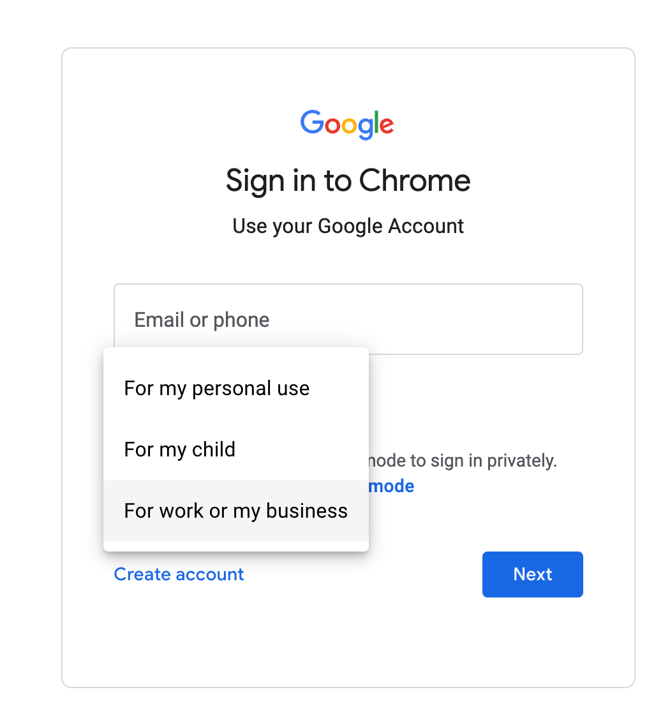
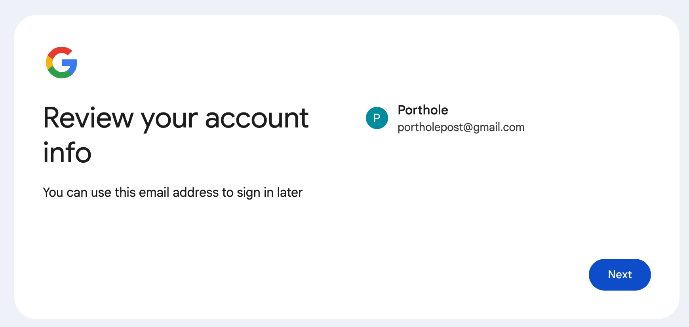

### Production

Today, I was working on [Porthole](https://github.com/headwinds/headwinds/wiki/Porthole-Chrome-Extension) and accidentally updated the password of the gmail account that used to send emails breaking the service.

In the [demo](https://porthole-demo.vercel.app/), a user can click on the email button and it should send an email to their account so that they review the article later.

While developing, I'm constantly reaching for AI support and sometimes their knowledge is behind. 

For instance, these are the instructions that Claude 3.5 Sonnet gave to fix my issue:

Access Google Account Settings

1. Go to [https://myaccount.google.com/](https://myaccount.google.com/)
1. Click "Security" on left menu
1. Verify 2-Step Verification is enabled
1. Create App Password

1. Go to [https://myaccount.google.com/apppasswords](https://myaccount.google.com/apppasswords)
1. Click "Select app" dropdown
1. Choose "Other (Custom name)"
1. Enter name "Mail API"
1. Click "Generate"
1. Copy 16-character password

The problem is that Google has since changed this flow. There is no Select App dropdown!

Next, I thought I'd try the free Gemini 1.5 thinking it might be closer to Google but, alas, it also provided out of date instructions. 

### Solution

1. Go to [https://myaccount.google.com/apppasswords](https://myaccount.google.com/apppasswords)
1. Create an app name like Mail API and it display a modal with a password phrase like "egja hgob qfel mxoo"
1. Copy this email somewhere safe and then go into your Gmail Setting by clicking the Gear icon and choose See All Settings
1. Go to the Accounts and Import tab and change your password to this password phrase
1. Go to the Forwarding and POP/IMAP tab and ensure Enable IMAP is checked

Claude did recommend this nice Python script to help test the connection:

```
gmail_from = your gmail account here
gmail_password = the password phrase here

def test_smtp():
    try:
        server = smtplib.SMTP('smtp.gmail.com', 587) #587
        print("1. Server connected")
        
        server.starttls()
        print("2. TLS started")
        
        username = gmail_from
        password = gmail_password
        print(f"3. Using email: {username}")
        
        server.login(username, password)
        print("4. Login successful")
        
        server.quit()
        print("5. Connection closed")
        return True

    except Exception as e:
        print(f"Error: {str(e)}")
        return False
```

Depending on where you put this script, you can run it from your Terminal. In my case, I can run it like:

```
python3 -c "from helpers.helpers_email import test_smtp; test_smtp()"
```

If all goes well, you should see the following in your terminal:

```
Attempting to connect to the database
Using connection None
Connected successfully to the local database
1. Server connected
2. TLS started
3. Using email: cabincraftapp@gmail.com
4. Login successful
5. Connection closed
```

When you update the password in your Gmail account, please allow some time (a few minutes?!) for it to propagate. I discovered this by accident. I tried to test it right away and it failed. Then I got busy doing something else, and I tried again after *some time* and it worked!

Once you've confirmed you can connect to your Gmail, then you're ready to send emails.

My complete gmail method looks like:

```
import smtplib
from email.mime.text import MIMEText
from email.mime.multipart import MIMEMultipart

def send_gmail(to_emails,
               subject,
               html,
               from_email):

    sender_email = from_email if from_email else gmail_from
    receiver_email = to_emails
    password = gmail_password

    heading_token = subject

    html_doc = f"""
    <!DOCTYPE html>
    <html>
    <head>
    <title>{heading_token}</title>
    </head>
    <body>
    {html}
    </body>
    </html>
    """

    # Create the email message
    message = MIMEMultipart("alternative")
    message["From"] = sender_email
    message["To"] = receiver_email
    message["Subject"] = subject

    # message.attach(MIMEText(body, "plain")) <-- plain text option
    part2 = MIMEText(html_doc, "html")
    message.attach(part2)

    # Establish the SMTP connection to Gmail's server
    try:
        server = smtplib.SMTP_SSL('smtp.gmail.com', 465)
        server.ehlo()
        server.login(sender_email, password)
        server.sendmail(sender_email, receiver_email, message.as_string())
        print("Gmail sent successfully!")
        return {"status_code": 200}
    except Exception as ex:
        print("Something went wrong:", ex)
    finally:
        server.quit()
```

I already have a flask endpoint setup to capture the request, and pass the variables on to use that send_gmail method.

If you're interested in discussing this further, please leave a comment on my [Discussions](https://github.com/headwinds/headwinds/discussions) board.

When using Gemini 2.0 Flash Experimental Model, I do appreciate it's final comment:

```
I know this is a bit of a detective process, but by systematically checking these points, we can pinpoint the cause and find the best solution for you. Let me know what you find after checking these things!
```

I wish I could responded with a link to this article! 🕵️

One of the goals of setting up this Github pages doc site was to write documentation for not just myself; even though I'm probably the primary reader at this point. 

In theory, this article can now be indexed by Google unlike Github wiki pages so Gemini, until you can access links directly in chat, there's hope for you yet to eventually discover it when its indexed.

### Add a Google Work Account

The following are required to get the App Password flow to work:

- Your Google Account has 2-Step Verification set up only for security keys.
- You’re logged into a **Work**, School, or another organization account.
- Your Google Account has Advanced Protection.



When adding a new google account to simply send mail, you need to setup a **Work** account, and choose the free route: Get a Gmail address. Then, I'd recommend clicking the subtle **Not Now** option since the Continue option will direct you to fill out a lot of forms more related to online store app.

When you fill in the first and last name, it's nice that they make the last name optional.  



After you create your work account, you must enable 2FA authentication. I used my phone and the [Google Authenticator](https://play.google.com/store/apps/details?id=com.google.android.apps.authenticator2&hl=en_CA&pli=1) because hey what's one more authentication?! Once 2FA is enabled, only then can you create your [app password](https://myaccount.google.com/apppasswords).

